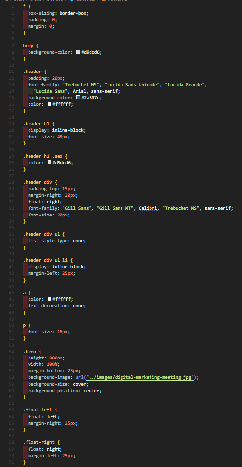
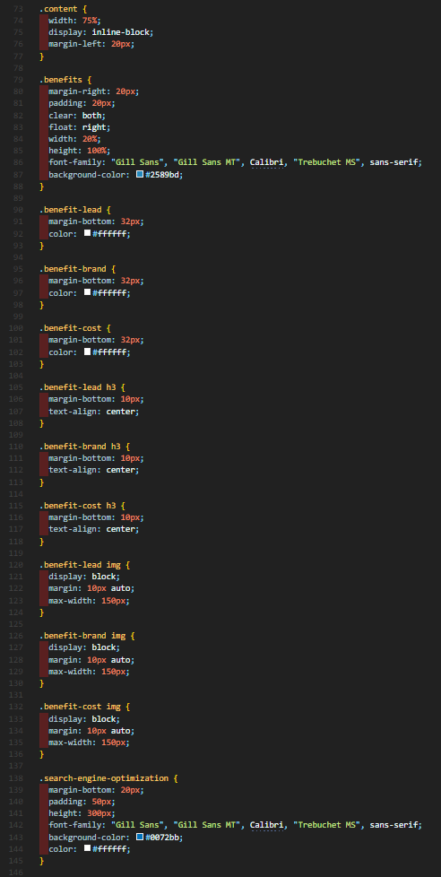
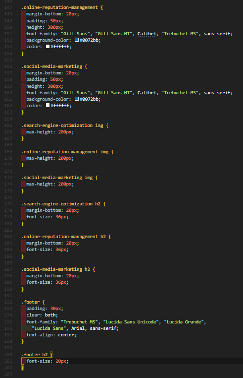
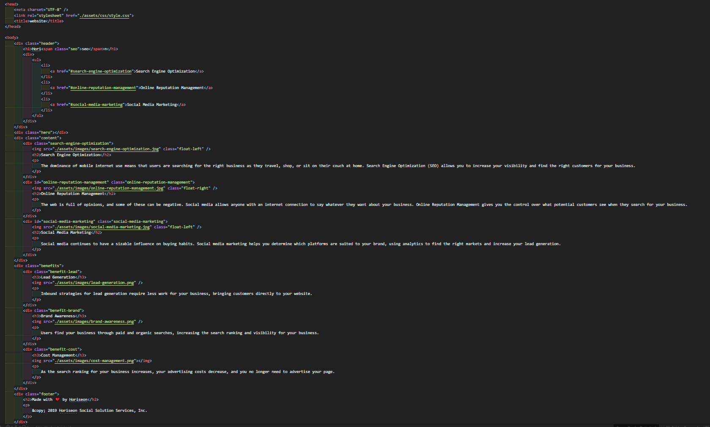

# Project:
  <h1>Horiseon Code Refactor</h1>

  Deployable Link - > https://reindeercode.github.io/Horiseon-Website-Update/


## Table of Contents: 
- [Project:](#project)
  - [Table of Contents:](#table-of-contents)
  - [License:](#license)
  - [Description:](#description)
  - [Images:](#images)
  - [Installation Instructions:](#installation-instructions)
  - [Test Command:](#test-command)
  - [My Github Username:](#my-github-username)
  - [My Email Address:](#my-email-address)
  - [Other Contributors:](#other-contributors)

## License:
[](https://opensource.org/licenses/MIT)

## Description:
One of the most common tasks for front-end and junior developers is to take existing code and refactor it to meet a certain set of standards or implement a new technology. In this homework, a marketing agency has hired you to refactor an existing site to make it more accessible.

Web accessibility is an increasingly important consideration for businesses. It ensures that people with disabilities can access a website using assistive technologies such as video captions, screen readers, and braille keyboards. Making a website accessible is also good for business for many reasons, one of them being that accessible sites are better positioned in search engines like Google. It also helps companies avoid litigation that can occur when people with disabilities cannot access their website.

To impress clients, you should always go the extra mile and improve the codebase for long-term sustainability. For example, make sure that all links are functioning correctly. Also, rework the CSS to make it more efficient by consolidating CSS selectors and properties, organizing them to follow the semantic structure of the HTML elements, and including comments before each element or section of the page.

User Story

```
AS A marketing agency
I WANT a codebase that follows accessibility standards
SO THAT our own site is optimized for search engines
```

Acceptance Criteria

```
GIVEN a webpage meets accessibility standards
WHEN I view the source code
THEN I find semantic HTML elements
WHEN I view the structure of the HTML elements
THEN I find that the elements follow a logical structure independent of styling and positioning
WHEN I view the image elements
THEN I find accessible alt attributes
WHEN I view the heading attributes
THEN they fall in sequential order
WHEN I view the title element
THEN I find a concise, descriptive title
```

## Images:








## Installation Instructions: 
n/a

## Test Command: 
Simply click the deployed link to visit the new site.

## My Github Username: 
Check out more projects on my Github at https://github.com/ReindeerCode

## My Email Address:
If you have any question please feel free to email me at ReindeerCode@gmail.com

## Other Contributors:
None at this time.
